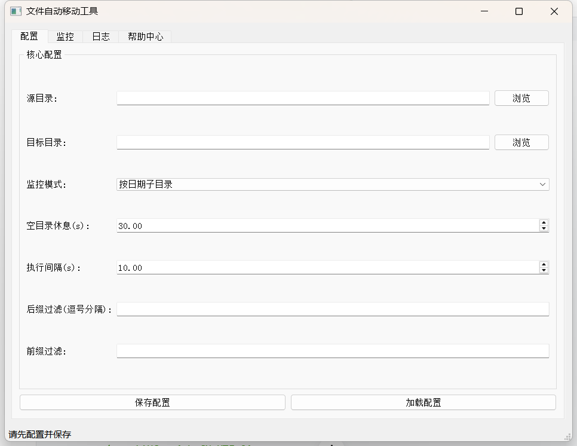
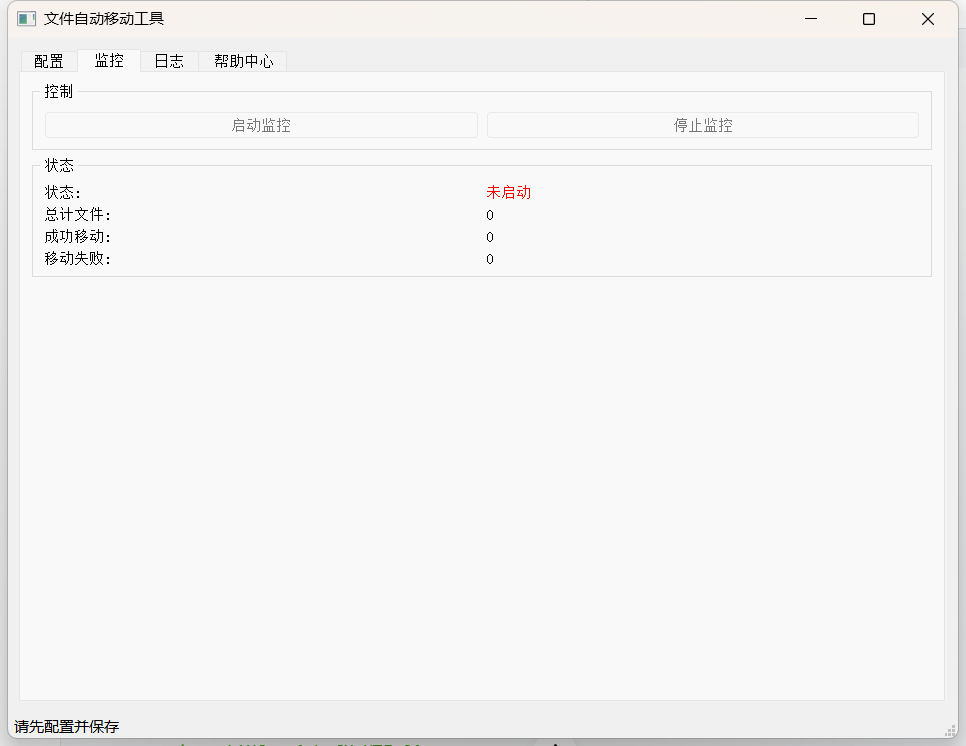
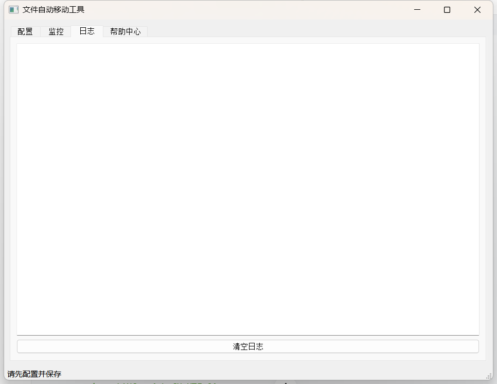
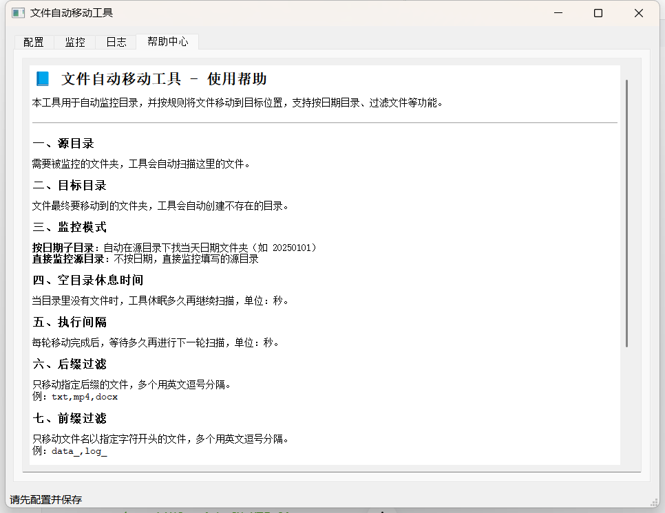

# 自动文件移动工具

一款基于 PyQt5 开发的 Windows 桌面工具，支持自动监控指定目录，按规则将文件移动到目标位置，支持日期子目录、文件过滤、配置持久化等功能。

## 📋 功能特点
- ✅ 可视化配置界面，无需编写代码
- ✅ 两种监控模式：按日期子目录/直接监控源目录
- ✅ 支持文件后缀/前缀过滤，精准移动指定文件
- ✅ 实时日志查看，运行状态一目了然
- ✅ 配置自动保存，重启后无需重新设置
- ✅ 自动处理重复文件（重命名避免覆盖）
- ✅ 空目录自动休眠，降低资源占用

## 📥 下载使用
### 方式1：直接下载EXE（推荐）
1. 进入仓库 [Releases](https://github.com/gongjuecloak/copy_tools/releases) 页面
2. 下载最新版本的 `自动文件移动工具.exe`
3. 无需安装，双击即可运行

### 方式2：源码运行
#### 环境要求
- Python 3.8+
- 依赖包：PyQt5、watchdog

#### 运行步骤
```bash
# 克隆仓库
git clone https://github.com/gongjuecloak/copy_tools.git
cd copy_tools

# 安装依赖
pip install pyqt5 watchdog

# 运行程序
python copy_tools.py
```

### 方式 3：自行打包 EXE
```bash
# 安装打包工具
pip install pyinstaller

# 打包为单文件EXE
pyinstaller --onefile --name "自动文件移动工具" --clean copy_tools.py

# 生成的EXE在 dist 目录下
```

## 截图



